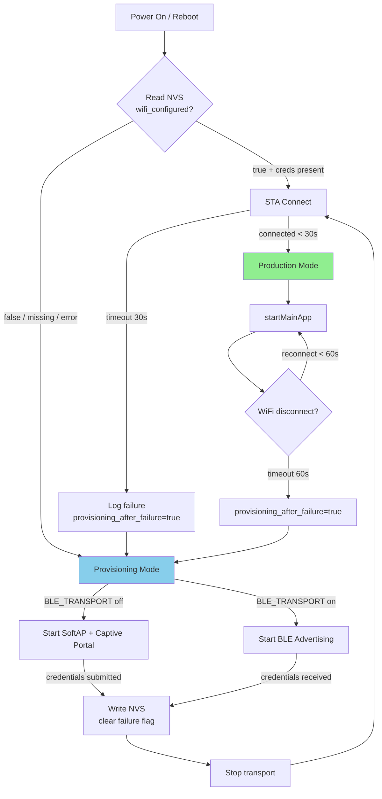
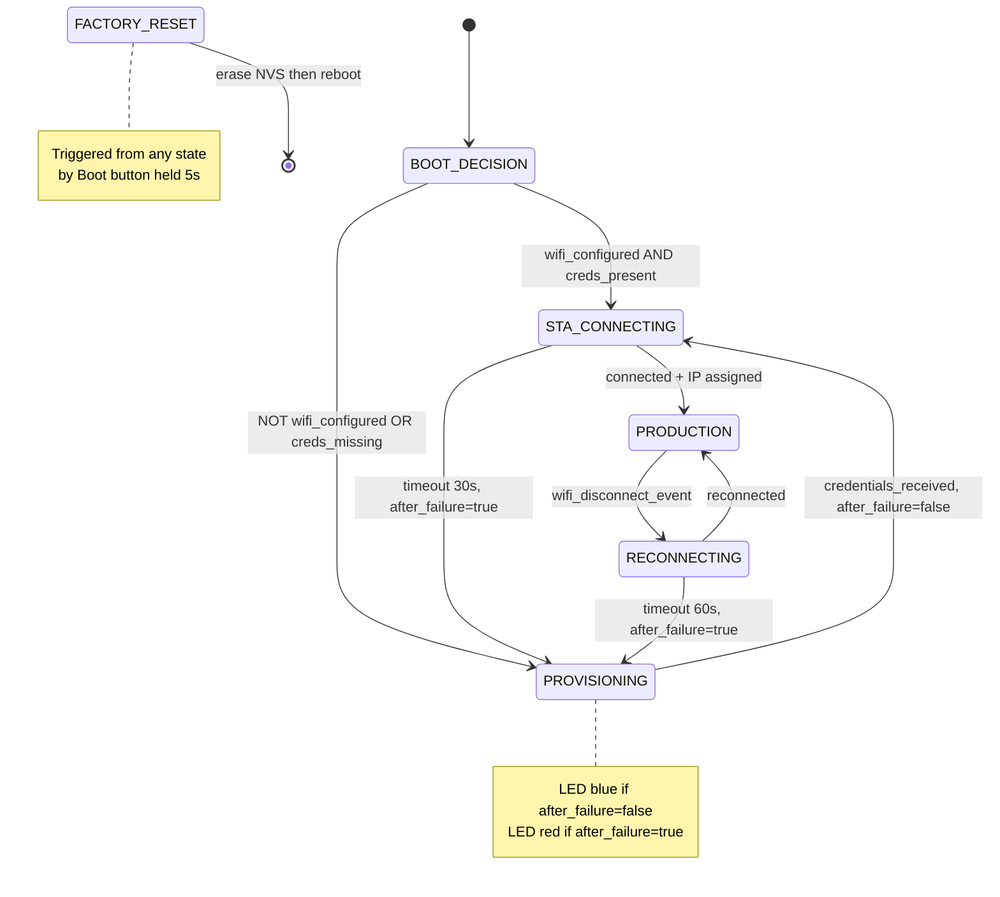
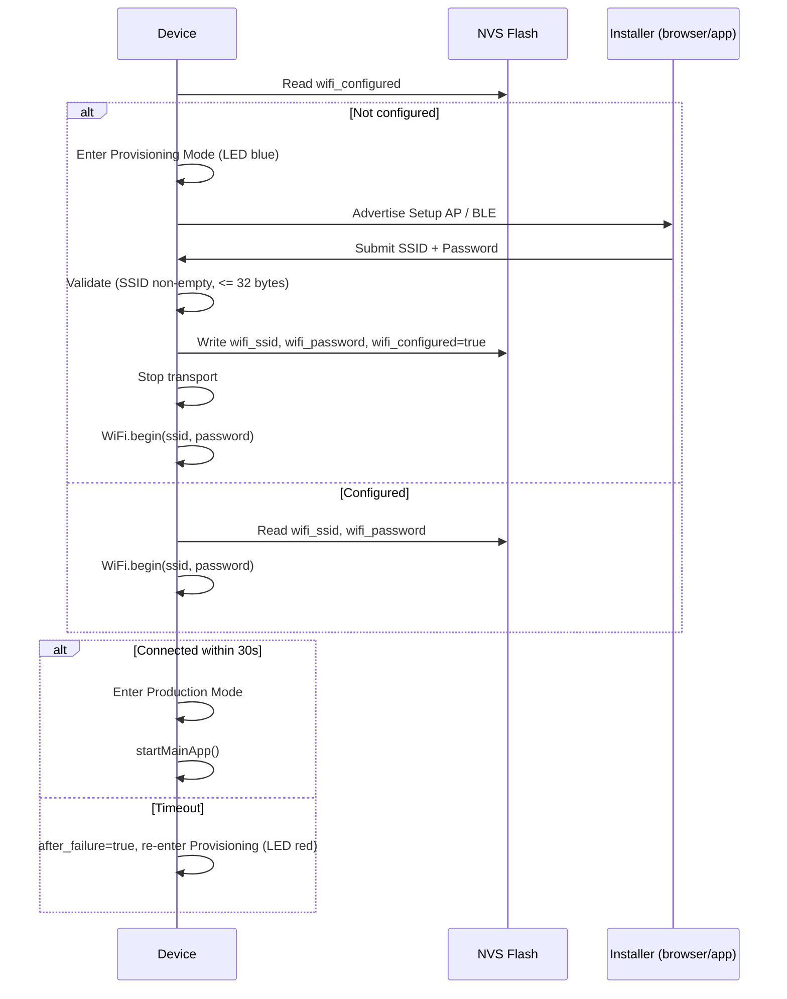

# Design Document: ESP32 WiFi Provisioning

## Overview

This design describes the firmware architecture for **Phase 1: first-boot WiFi onboarding** on the ESP32-C61-DevKitC-1 v2.0. The firmware implements a state machine that decides between provisioning mode (SoftAP captive portal or BLE) and production mode (STA connected, application running) based on NVS-persisted credential state.

Two transport profiles share identical core logic:

- **Default (SoftAP):** Device hosts an open AP with DNS-redirected captive portal for browser-based credential entry.
- **Optional (BLE):** Device advertises via Espressif Unified Provisioning; credentials arrive over BLE using the ESP BLE Prov app.

Both profiles write the same NVS keys, drive the same LED patterns, honor the same factory-reset mechanism, and call `startMainApp()` upon WiFi STA connection. Phase 1 does **not** set `aws_provisioned` or start any cloud connectivity.

### Milestone order

```
Power on → WiFi onboarding (this design) → startMainApp → [Phase 2] AWS fleet provision
```

### Scope alignment

| In scope (Phase 1) | Out of scope (Phase 2+) |
|--------------------|-------------------------|
| Boot decision, SoftAP portal, optional BLE | AWS IoT fleet provisioning |
| STA connect + reconnect | Claim cert, RegisterThing, MQTT |
| NVS WiFi persistence, factory reset | OTA, Jobs, Device Shadow |
| LED + serial diagnostics | Custom mobile app |
| `startMainApp` heartbeat placeholder | Hardcoded site WiFi |

### Key Design Decisions

| Decision | Choice | Rationale |
|----------|--------|-----------|
| State machine location | Single `provisioning.cpp` module | Keeps WiFi/provisioning logic isolated from app logic per Req 10.3 |
| NVS library | Arduino `Preferences` | Arduino-native, simple key-value API, namespace support, works across ESP32 variants |
| Captive portal web server | `WebServer` + `DNSServer` (Arduino core) | Minimal dependencies; built into arduino-esp32; sufficient for single-client captive portal |
| BLE provisioning | `WiFiProv` library (arduino-esp32) | Official Espressif Arduino wrapper around unified provisioning; handles protocomm, security, and resource cleanup |
| RGB LED driver | Adafruit NeoPixel (or `neopixelWrite` built-in) | Wide PlatformIO support; RMT-based timing; proven on RISC-V ESP32 variants; GPIO8 compatible (see Open Items) |
| Transport selection | Compile-time `BLE_TRANSPORT` flag | One binary per profile; no runtime negotiation needed per Req 8.2 |
| Reconnect strategy | WiFi auto-reconnect + 60 s watchdog | Arduino WiFi stack handles reconnect; firmware monitors and falls back to provisioning if exceeded per Req 3.6 |
| Provisioning LED after failure | `provisioning_after_failure` flag | Req 6 distinguishes fresh provisioning (blue) from post-failure provisioning (red) |

### Target hardware

| Item | Value |
|------|--------|
| Board | ESP32-C61-DevKitC-1 **v2.0** |
| Module | ESP32-C61-WROOM-1 (8 MB flash / 2 MB PSRAM typical) |
| SoC | ESP32-C61, RISC-V single-core, 2.4 GHz WiFi 6 + BLE 5 |
| RGB LED | GPIO8 (addressable; strapping pin — driver must not drive low during reset) |
| Boot button | Factory reset trigger (debounced) |
| USB | **USB Type-C to UART** bridge for flash/serial (per Espressif v2.0 guide) |
| Serial | 115200 baud |

**Not in scope:** ESP32-S3, ESP32-C3-DevKit-RUST-1, classic `esp32dev` boards.

### Toolchain

| Item | Value |
|------|--------|
| Language | C++ |
| Framework | Arduino (ESP32 core v3.x) |
| Build | PlatformIO (primary) or Arduino IDE 2.x |
| Board target | `esp32-c61-devkitc-1` |
| BLE library | `WiFiProv` when `BLE_TRANSPORT` enabled |

### Research findings

1. **ESP32-C61 PlatformIO support**: The C61 is relatively new. PlatformIO's `espressif32` platform supports it via custom board JSON if not yet in the official registry. The `arduino-esp32` core v3.x supports C61 with Arduino-as-IDF-component builds. The `platformio.ini` may need `platform_packages` overrides to pin a compatible framework version.

2. **Captive portal pattern**: The standard Arduino approach uses `DNSServer` to redirect all DNS queries to the gateway IP (`192.168.4.1`), combined with `WebServer` serving the configuration page. Android/iOS/Windows captive portal detection endpoints trigger automatic browser popup when DNS hijack returns the gateway IP.

3. **WiFiProv BLE path**: The `WiFiProv` library wraps ESP-IDF's unified provisioning. Call `WiFiProv.beginProvision(WIFI_PROV_SCHEME_BLE, ...)` with security level and PoP string. After provisioning completes, call `wifi_prov_mgr_deinit()` to free BLE/BTDM memory per Req 9.4.

4. **NVS via Preferences**: `Preferences` provides `begin(namespace)`, `putString(key, value)`, `getString(key)`, `putBool(key, value)`, `getBool(key)`, `clear()`, and `remove(key)`. Namespace isolation (`"wifi"`) keeps credentials separate from future `"aws"` namespace.

5. **GPIO8 on C61**: GPIO8 is a strapping pin (boot mode). The RGB LED driver must not drive GPIO8 low during reset. After boot, GPIO8 is safe for NeoPixel data. The RMT peripheral provides precise timing for WS2812 protocol.

6. **2.4 GHz only**: ESP32-C61 STA mode supports 2.4 GHz (802.11 b/g/n/ax). Captive portal scan results and documentation must state that 5 GHz-only networks are unsupported per Req 3.5.

---

## Architecture

### System flow



### State machine



### Module layout

```text
src/
├── main.cpp              # setup() + loop(); delegates to state machine
├── provisioning.h        # Public API: initProvisioning(), factoryReset()
├── provisioning.cpp      # State machine, NVS, transport orchestration
├── captive_portal.h      # SoftAP + DNS + WebServer (compile-guarded)
├── captive_portal.cpp
├── ble_prov.h            # WiFiProv BLE wrapper (compile-guarded)
├── ble_prov.cpp
├── boot_button.h         # Debounced hold detection for factory reset
├── boot_button.cpp
├── led_status.h          # LED pattern driver
├── led_status.cpp
├── nvs_store.h           # Preferences wrapper for wifi namespace
├── nvs_store.cpp
├── config.h              # Compile-time constants
└── app_main.cpp          # startMainApp() — Phase 1 heartbeat
```

---

## Components and interfaces

### 1. State machine (`provisioning.cpp`)

The central coordinator. Implements the boot decision and state transitions.

```cpp
enum class DeviceState : uint8_t {
    BOOT_DECISION = 0,
    PROVISIONING = 1,
    STA_CONNECTING = 2,
    PRODUCTION = 3,
    RECONNECTING = 4,
    FACTORY_RESET = 5
};

enum class Event : uint8_t {
    CREDS_PRESENT,
    CREDS_MISSING,
    CREDENTIALS_RECEIVED,
    WIFI_CONNECTED,
    WIFI_TIMEOUT,
    WIFI_DISCONNECT,
    RECONNECT_TIMEOUT,
    BUTTON_HELD
};

// Public interface
void initProvisioning();         // Called from setup()
void loopProvisioning();         // Called from loop()
DeviceState getCurrentState();   // For LED driver polling
bool isProvisioningAfterFailure();  // Drives red vs blue LED in PROVISIONING
```

**Transitions:**

- `BOOT_DECISION → STA_CONNECTING`: NVS has valid credentials (`wifi_configured` true, non-empty SSID)
- `BOOT_DECISION → PROVISIONING`: NVS empty, flag false, or read error (`after_failure=false`)
- `STA_CONNECTING → PRODUCTION`: WiFi connected with IP within 30 s
- `STA_CONNECTING → PROVISIONING`: 30 s timeout; set `after_failure=true`; credentials remain in NVS (Req 2.9)
- `PROVISIONING → STA_CONNECTING`: credentials received; clear `after_failure`
- `PRODUCTION → RECONNECTING`: WiFi disconnect event
- `RECONNECTING → PRODUCTION`: reconnected within 60 s
- `RECONNECTING → PROVISIONING`: 60 s elapsed; set `after_failure=true`
- Any → `FACTORY_RESET`: Boot button held ≥ `FACTORY_RESET_HOLD_MS`

**Boot decision timing:** NVS read and initial state selection complete within `BOOT_DECISION_MAX_MS` (2 s) per Req 1.3. Phase 1 does not start AWS/MQTT/TLS per Req 1.4.

### 2. NVS store (`nvs_store.h`)

Thin wrapper around Arduino `Preferences` with the `"wifi"` namespace.

```cpp
#pragma once
#include <Arduino.h>

struct WiFiCredentials {
    String ssid;
    String password;
    bool configured;
};

namespace NvsStore {
    bool init();
    WiFiCredentials loadCredentials();
    bool saveCredentials(const String& ssid, const String& password);
    void eraseWiFiCredentials();  // Factory reset: clears ssid, password, configured=false
    bool isConfigured();
}
```

**NVS keys** (namespace `"wifi"`):

| Key | Type | Description |
|-----|------|-------------|
| `wifi_ssid` | String (max 32 chars) | Target network SSID |
| `wifi_password` | String (max 64 chars) | WPA2 passphrase (empty allowed for open networks) |
| `wifi_configured` | Bool | True after successful credential save |

**Separate namespace `"aws"`** (reserved, not written in Phase 1):

| Key | Type | Description |
|-----|------|-------------|
| `aws_provisioned` | Bool | Reserved for Phase 2; unchanged by factory reset |

### 3. Captive portal (`captive_portal.h`)

Active only when `BLE_TRANSPORT` is not defined.

```cpp
#pragma once
#include <Arduino.h>

struct PortalCredentials {
    bool received;
    String ssid;
    String password;
};

namespace CaptivePortal {
    void start(const String& apSsid);  // Start SoftAP + DNS + WebServer
    void stop();                         // Tear down AP and servers
    void loop();                         // Process DNS + HTTP in main loop
    bool hasNewCredentials();            // Poll: credentials submitted?
    PortalCredentials getCredentials();  // Retrieve submitted creds (once)
}
```

**Behavior:**

- Starts SoftAP with SSID `ESP-Setup-XXXX` (last 2 bytes of MAC, uppercase hex) per Req 2.1
- Open network by default; optional `SETUP_AP_PASSWORD` compile flag for WPA2 on Setup_AP per Req 2.2
- `DNSServer` on port 53 redirects all queries to `192.168.4.1`
- `WebServer` on port 80 serves HTML form and handles credential submission
- Captive portal detection endpoints (`/generate_204`, `/hotspot-detect.html`, `/connecttest.txt`) return redirect to `/`
- `GET /scan` returns 2.4 GHz visible networks when scan is feasible on C61 (Req 2.5 SHOULD)

### 4. BLE provisioning (`ble_prov.h`)

Active only when `BLE_TRANSPORT` is defined.

```cpp
#pragma once
#include <Arduino.h>

namespace BleProv {
    void start(const String& serviceName, const String& pop);
    void stop();   // Deinit provisioning manager, free BT memory
    void loop();   // Process provisioning events
    bool hasNewCredentials();
    WiFiCredentials getCredentials();
}
```

**Behavior:**

- Uses `WiFiProv.beginProvision(WIFI_PROV_SCHEME_BLE, WIFI_PROV_SCHEME_HANDLER_FREE_BTDM, WIFI_PROV_SECURITY_1, pop, serviceName)`
- Service name: `PROV_XXXX` (MAC-derived) or compile-time `PROV_SERVICE_NAME` per Req 9.3
- PoP: compile-time `PROV_POP` (demo default `abcd1234`); never logged per Req 7.5
- After provisioning event fires (`ARDUINO_EVENT_PROV_CRED_RECV`), extracts SSID/password
- On success or manual stop, releases BTDM memory per Req 9.4
- Does not start Setup_AP when active per Req 9.1

### 5. Boot button (`boot_button.h`)

```cpp
#pragma once
#include <Arduino.h>

namespace BootButton {
    void init();           // Configure GPIO, debounce state
    void update();         // Call each loop(); returns true when hold threshold met
    bool isHeld();         // Current debounced pressed state
}
```

**Behavior:**

- Debounce window: 50 ms (compile-time constant) per Req 5.4
- Hold threshold: `FACTORY_RESET_HOLD_MS` (5000 ms default) per Req 5.1
- Triggers `FACTORY_RESET` state from any active state
- Uses active-low Boot button on DevKitC (standard Espressif wiring)

### 6. LED status (`led_status.h`)

Drives the addressable RGB LED on GPIO8.

```cpp
#pragma once
#include <Arduino.h>

namespace LedStatus {
    bool init();                          // Configure NeoPixel, respecting boot strapping
    void update(DeviceState state, bool provisioningAfterFailure);
    void flashWhite();                    // One-shot for factory reset acknowledgment
    bool isInitialized();                 // False if driver init failed
}
```

**Pattern mapping** (Req 6):

| Condition | Color | Pattern |
|-----------|-------|---------|
| `PROVISIONING` + `!provisioningAfterFailure` | Blue (0, 0, 255) | 500 ms on / 500 ms off |
| `PROVISIONING` + `provisioningAfterFailure` | Red (255, 0, 0) | 500 ms on / 500 ms off |
| `STA_CONNECTING` or `RECONNECTING` | Yellow (255, 200, 0) | 500 ms on / 500 ms off |
| `PRODUCTION` | Green (0, 255, 0) | Solid |
| `FACTORY_RESET` | White (255, 255, 255) | Single 200 ms flash before reboot |

If RGB driver init fails, all other behavior continues; serial logs note the failure per Req 6.2.

### 7. Configuration (`config.h`)

```cpp
#pragma once

// --- Transport selection ---
// #define BLE_TRANSPORT  // Set via build_flags in platformio.ini

// --- Timeouts ---
#define STA_CONNECT_TIMEOUT_MS    30000
#define WIFI_RECONNECT_TIMEOUT_MS 60000
#define FACTORY_RESET_HOLD_MS     5000
#define BOOT_DECISION_MAX_MS      2000
#define BUTTON_DEBOUNCE_MS        50

// --- SoftAP ---
// #define SETUP_AP_PASSWORD "mypassword"  // Uncomment for WPA2 on setup AP
#define CAPTIVE_PORTAL_IP IPAddress(192, 168, 4, 1)

// --- BLE ---
#define PROV_POP "abcd1234"
// #define PROV_SERVICE_NAME "PROV_CUSTOM"  // Override MAC-derived name

// --- LED ---
#define LED_PIN 8
#define LED_COUNT 1
#define LED_BLINK_INTERVAL_MS 500

// --- Serial ---
#define SERIAL_BAUD 115200

// --- Firmware ---
#define FIRMWARE_VERSION "1.0.0-phase1"

// --- Heartbeat ---
#define HEARTBEAT_INTERVAL_MS 30000
```

### 8. Application hook (`app_main.cpp`)

```cpp
// Called exactly once when entering Production Mode
void startMainApp();
```

Phase 1 implementation: periodic heartbeat logging IP address every 30 s per Req 10.4. Phase 2 extends this with AWS IoT fleet provisioning without modifying WiFi onboarding modules.

### 9. Identifier derivation (`provisioning.cpp` helper)

```cpp
String macToSetupApSsid(const uint8_t mac[6]);   // "ESP-Setup-EEFF"
String macToBleServiceName(const uint8_t mac[6]); // "PROV_EEFF"
```

Both derived at runtime from `WiFi.macAddress()` / `esp_read_mac()` — no per-device compile flags per Req 8.1.

---

## Data models

### NVS data layout

```text
Partition: nvs (default)
├── Namespace: "wifi"
│   ├── wifi_ssid: String[32]       — Target SSID
│   ├── wifi_password: String[64]   — WPA2 passphrase
│   └── wifi_configured: Bool       — Credential validity flag
└── Namespace: "aws" (Phase 2, not written in Phase 1)
    └── aws_provisioned: Bool       — Reserved; untouched by factory reset
```

### Captive portal HTTP endpoints

| Method | Path | Request | Response |
|--------|------|---------|----------|
| GET | `/` | — | HTML form page |
| GET | `/scan` | — | JSON: `[{"ssid":"...","rssi":-42,"enc":3}]` |
| POST | `/save` | Form: `ssid=X&password=Y` | HTML success or error page |
| GET | `/generate_204` | — | 302 redirect to `/` (Android captive detect) |
| GET | `/hotspot-detect.html` | — | 302 redirect to `/` (Apple captive detect) |
| GET | `/connecttest.txt` | — | 302 redirect to `/` (Windows captive detect) |

### Build configuration (`platformio.ini`) — Req 11

```ini
[env:esp32-c61-softap]
platform = espressif32
board = esp32-c61-devkitc-1
framework = arduino
monitor_speed = 115200
build_flags =
    -DFIRMWARE_VERSION=\"1.0.0-phase1\"
    -Wall

[env:esp32-c61-ble]
platform = espressif32
board = esp32-c61-devkitc-1
framework = arduino
monitor_speed = 115200
build_flags =
    -DBLE_TRANSPORT
    -DFIRMWARE_VERSION=\"1.0.0-phase1\"
    -Wall

; Optional host tests (no hardware)
[env:native]
platform = native
test_build_src = true
build_flags = -DUNIT_TEST
```

README SHALL document: flash command per environment, Boot+Reset recovery, UART USB port, and ESP BLE Prov app requirement for BLE build per Req 11.3.

### Serial log format — Req 7

**SoftAP boot:**

```text
[BOOT] FW=1.0.0-phase1 chip=ESP32-C61 mac=AA:BB:CC:DD:EE:FF transport=softap wifi_configured=false
[STATE] BOOT_DECISION -> PROVISIONING uptime=150ms
[SOFTAP] SSID=ESP-Setup-EEFF gateway=192.168.4.1
[CREDS] Credentials received, SSID length=8, validation=OK
[STATE] PROVISIONING -> STA_CONNECTING uptime=45200ms
[WIFI] Connected IP=192.168.1.42 RSSI=-55
[STATE] STA_CONNECTING -> PRODUCTION uptime=48100ms
[APP] Heartbeat IP=192.168.1.42 uptime=78100ms
```

**BLE boot:**

```text
[BOOT] FW=1.0.0-phase1 chip=ESP32-C61 mac=AA:BB:CC:DD:EE:FF transport=ble wifi_configured=false
[STATE] BOOT_DECISION -> PROVISIONING uptime=120ms
[BLE] service=PROV_EEFF pop_required=true
[CREDS] Credentials received, SSID length=8, validation=OK
[STATE] PROVISIONING -> STA_CONNECTING uptime=38100ms
[WIFI] Connected IP=192.168.1.42 RSSI=-55
[STATE] STA_CONNECTING -> PRODUCTION uptime=40200ms
[APP] Heartbeat IP=192.168.1.42 uptime=70200ms
```

**Failure re-entry:**

```text
[WIFI] Connect failed reason=201 timeout=30000ms
[STATE] STA_CONNECTING -> PROVISIONING uptime=31200ms after_failure=true
[SOFTAP] SSID=ESP-Setup-EEFF gateway=192.168.4.1
```

Password values never appear in any log line per Req 7.6.

### WiFi credential flow (sequence)



---

## Phase 2 interface (informational)

Phase 2 extends `startMainApp()` only. WiFi onboarding modules remain unchanged.

```cpp
void startMainApp() {
    if (!NvsStore::isAwsProvisioned()) {
        runFleetProvisioning();  // claim cert → RegisterThing
    }
    connectAwsMqtt();
    // existing Phase 1 heartbeat may remain or move
}
```

Phase 2 SHALL NOT modify WiFi NVS keys or Provisioning_Mode logic without a versioned migration spec.

---

## Correctness properties

*A property is a characteristic or behavior that should hold true across all valid executions of a system — essentially, a formal statement about what the system should do. Properties serve as the bridge between human-readable specifications and machine-verifiable correctness guarantees.*

The following properties cover the testable pure-logic portions of the firmware. Hardware I/O, timing on real silicon, and integration with the WiFi/BLE stacks are validated through integration tests on physical devices.

### Property 1: Boot decision correctness

*For any* NVS state, if `wifi_configured` is true AND a non-empty SSID is stored, the boot decision function SHALL return `STA_CONNECTING`; otherwise it SHALL return `PROVISIONING`.

**Validates: Requirements 1.1, 1.2**

### Property 2: State machine transition correctness

*For any* valid (current_state, event) pair, the state machine transition function SHALL produce the correct next state according to the defined transition table: STA_CONNECTING + timeout → PROVISIONING (with `after_failure=true`), STA_CONNECTING + connected → PRODUCTION, PRODUCTION + disconnect → RECONNECTING, RECONNECTING + timeout → PROVISIONING (with `after_failure=true`), RECONNECTING + connected → PRODUCTION, PROVISIONING + credentials_received → STA_CONNECTING (with `after_failure=false`).

**Validates: Requirements 1.5, 2.8, 2.9, 3.4, 3.6**

### Property 3: startMainApp exactly-once invariant

*For any* sequence of state machine transitions, `startMainApp()` SHALL be invoked exactly once per entry into PRODUCTION state — never in any other state, never skipped on entry, and never called a second time without leaving and re-entering PRODUCTION.

**Validates: Requirements 3.2, 3.3, 10.1, 10.2**

### Property 4: MAC-to-identifier derivation

*For any* valid 6-byte MAC address, the identifier derivation function SHALL produce a string matching the pattern `ESP-Setup-XXXX` (for SoftAP) or `PROV_XXXX` (for BLE) where `XXXX` is the uppercase hexadecimal representation of the last 2 MAC bytes, and the function SHALL be deterministic (same MAC always produces same output).

**Validates: Requirements 2.1, 8.1, 9.3**

### Property 5: Credential validation

*For any* SSID string, the validation function SHALL accept it if and only if it is non-empty and ≤32 bytes; *for any* password string, it SHALL accept it if it is ≤64 bytes (including empty for open networks). Invalid inputs SHALL be rejected without modifying NVS state.

**Validates: Requirements 2.6**

### Property 6: NVS credential round-trip

*For any* valid credential pair (SSID 1–32 bytes, password 0–64 bytes), writing credentials to NVS and reading them back SHALL produce an identical pair with `wifi_configured` set to true.

**Validates: Requirements 4.1, 9.5**

### Property 7: Factory reset selective erase

*For any* NVS state containing arbitrary values for `wifi_ssid`, `wifi_password`, `wifi_configured`, and `aws_provisioned`, performing a factory reset SHALL set `wifi_configured` to false, remove `wifi_ssid` and `wifi_password`, and leave `aws_provisioned` unchanged at its pre-reset value.

**Validates: Requirements 4.5, 5.2**

### Property 8: Button hold threshold and debounce

*For any* button hold duration in milliseconds, the factory reset detector SHALL trigger if and only if the debounced pressed duration is ≥ `FACTORY_RESET_HOLD_MS` (5000 ms default). Durations below the threshold, including debounce noise (rapid toggles shorter than `BUTTON_DEBOUNCE_MS`), SHALL NOT trigger a reset.

**Validates: Requirements 5.1, 5.4**

### Property 9: LED state mapping

*For any* (`DeviceState`, `provisioningAfterFailure`) pair, the LED controller SHALL output the correct (color, pattern): PROVISIONING + false → blink blue, PROVISIONING + true → blink red, STA_CONNECTING or RECONNECTING → blink yellow, PRODUCTION → solid green, FACTORY_RESET → solid white flash.

**Validates: Requirements 6.1 (full table)**

### Property 10: Password never logged

*For any* credential submission (valid or invalid) containing any password string, the log output produced by the credential handling function SHALL NOT contain the password value as a substring.

**Validates: Requirements 7.6**

### Property 11: Log format completeness

*For any* boot state (MAC, transport, wifi_configured) and *for any* state transition (from_state, to_state, uptime), the log formatting functions SHALL produce output containing all required fields: boot log includes firmware version, chip model, MAC, transport, and configured state; transition log includes from-state, to-state, and uptime milliseconds; SoftAP start log includes SSID and gateway; BLE start log includes service name and pop_required flag (not PoP value).

**Validates: Requirements 7.2, 7.3, 7.4, 7.5**

### Property 12: Transport exclusivity

*For any* entry into Provisioning_Mode, if BLE_TRANSPORT is enabled then only BLE advertising SHALL start (no SoftAP), and if BLE_TRANSPORT is disabled then only SoftAP SHALL start (no BLE initialization). Both transport paths SHALL write identical NVS keys (`wifi_ssid`, `wifi_password`, `wifi_configured`).

**Validates: Requirements 9.1, 9.5, 9.6**

---

## Non-functional requirements

| ID | Requirement | Design response |
|----|-------------|-----------------|
| NF1 | Boot to Provisioning_Mode or first STA attempt within 5 s | Cooperative `setup()` completes NVS init + boot decision quickly; STA connect may continue past 5 s |
| NF2 | Captive portal page load within 3 s of client associating | Minimal HTML/CSS; single `WebServer` client; scan on separate async request |
| NF3 | No dynamic heap allocation in hot-path state transitions | Prefer stack buffers and pre-allocated `String` reuse where practical; recommended not blocking for demo |
| NF4 | Compile with `-Wall` without warnings in project code | Enabled in `platformio.ini` build_flags |

---

## Error handling

### Error categories and recovery

| Error | Detection | Recovery | LED |
|-------|-----------|----------|-----|
| NVS read failure | `Preferences::begin()` returns false or key read returns empty when configured=true | Treat as unconfigured → enter Provisioning (`after_failure=false`) | Blink blue |
| NVS write failure | `putString()` / `putBool()` returns 0 | Log error, remain in Provisioning, re-display form | Blink blue |
| STA connection timeout | 30 s timer expires without connected event | Transition to Provisioning with `after_failure=true`; creds kept in NVS | Blink red |
| WiFi disconnect in Production | `WIFI_EVENT_STA_DISCONNECTED` callback | Enter RECONNECTING, retry for 60 s | Blink yellow |
| Reconnect timeout | 60 s in RECONNECTING without reconnect | Enter Provisioning with `after_failure=true` | Blink red |
| RGB LED init failure | NeoPixel constructor or first write fails | Log warning, continue without LED feedback | N/A |
| DNS server start failure | `DNSServer::start()` fails | Log error, portal still accessible via direct IP | Blink blue/red per failure flag |
| Invalid credentials submitted | Empty SSID or SSID > 32 bytes | Return HTTP error page, stay in Provisioning | Blink blue/red per failure flag |
| SoftAP start failure | `WiFi.softAP()` returns false | Log critical error, retry after 2 s, max 3 retries then reboot | Blink red |
| BLE init failure | `WiFiProv.beginProvision()` throws or fails | Log error, retry max 3 times, then reboot | Blink red |

### Graceful degradation principles

1. **LED is non-critical**: All functionality works without LED feedback. Serial remains the authoritative diagnostic channel per Req 6.2.
2. **Provisioning transport failure is critical**: If SoftAP or BLE cannot start after retries, reboot is the only recovery (hardware may be in bad state).
3. **NVS corruption**: If configured=true but SSID is empty/unreadable, treat as unconfigured (enter Provisioning). Log the inconsistency.
4. **Watchdog**: Arduino framework task WDT protects against infinite loops. Cooperative `loop()` design ensures yields happen within WDT window.

### Security considerations

| Concern | Mitigation |
|---------|------------|
| Open SoftAP in demo mode | Acceptable for demo; `SETUP_AP_PASSWORD` compile flag available for production per Req 2.2 |
| Password in NVS (plaintext) | ESP-IDF NVS encryption available but not enabled in Phase 1; document for Phase 2 hardening |
| BLE PoP is fleet-wide constant | Demo only (`abcd1234`); document per-device PoP rotation for production per Req 9.2 |
| Captive portal is HTTP (no TLS) | SoftAP is local-only, no internet routing; acceptable for credential entry on isolated network |
| Credential logging | Password is NEVER logged; only SSID length is logged during credential handling |

---

## Testing strategy

### Test layers

```text
┌─────────────────────────────────────────────────┐
│  Integration Tests (real hardware, 2 boards)       │  Req 12 demo walkthrough
├─────────────────────────────────────────────────┤
│  Unit Tests (host-compiled, mocked HAL)          │  Specific examples + edge cases
├─────────────────────────────────────────────────┤
│  Property Tests (host-compiled, 100+ iterations) │  Universal correctness properties
└─────────────────────────────────────────────────┘
```

### Property-based testing

**Library:** [Rapidcheck](https://github.com/emil-e/rapidcheck) — C++ property-based testing framework, compatible with GoogleTest and PlatformIO native builds.

**Configuration:**

- Minimum 100 iterations per property
- Seed logged for reproducibility
- Each test tagged with property reference comment

**Property test plan:**

| Property | Test target function | Generator strategy |
|----------|---------------------|-------------------|
| P1: Boot Decision | `bootDecision(NvsState) → DeviceState` | Random NvsState structs (bool configured, String ssid 0–32 chars, String pass 0–64 chars) |
| P2: State Transitions | `transition(DeviceState, Event) → DeviceState` | All valid (state, event) pair combinations |
| P3: startMainApp Once | Simulate N transitions, count startMainApp calls | Random event sequences of length 1–50 |
| P4: MAC Derivation | `macToSsid(uint8_t[6]) → String` | Random 6-byte arrays |
| P5: Credential Validation | `validateCredentials(String, String) → bool` | Random strings of length 0–100, including unicode and whitespace |
| P6: NVS Round-Trip | Write then read via NvsStore mock | Random valid credential pairs (ssid 1–32, pass 0–64) |
| P7: Factory Reset | Pre-populate NVS mock, call erase, verify | Random NVS states with various aws_provisioned values |
| P8: Button Threshold | `shouldReset(durationMs) → bool` | Random uint32_t durations 0–30000 with debounce simulation |
| P9: LED Mapping | `stateToColor(DeviceState, bool) → RGB` | All DeviceState × afterFailure combinations |
| P10: Password Not Logged | Capture log output from credential handler | Random passwords including special chars, empty, very long |
| P11: Log Format | Format boot/transition logs, parse for fields | Random MACs, states, uptimes, transports |

**Tag format:** `// Feature: esp32-wifi-provisioning, Property {N}: {title}`

### Unit tests (example-based)

| Test | Validates |
|------|-----------|
| SoftAP starts with correct SSID format for known MAC | Req 2.1 |
| Open AP when no password defined | Req 2.2 |
| Captive portal HTML contains ssid and password form fields | Req 2.5 |
| BLE not initialized when BLE_TRANSPORT undefined | Req 9.6 |
| BLE resources freed after provisioning completes | Req 9.4 |
| LED continues working despite init failure (graceful degradation) | Req 6.2 |
| Heartbeat log output in startMainApp | Req 10.4 |
| NVS wifi keys independent from aws_provisioned | Req 4.4 |
| PlatformIO env names match spec | Req 11.1 |

### Integration tests (hardware) — Req 12

Executed on physical ESP32-C61-DevKitC-1 v2.0 boards:

1. **First boot flow**: Flash → Provisioning → Submit creds → STA connect → Production (Req 12.2)
2. **Persistence**: Reboot → Direct STA connect without Setup_AP within 30 s (Req 12.3)
3. **Second device**: Repeat steps 1–2 independently on Device B (Req 12.4)
4. **Factory reset**: Hold Boot 5 s → LED white → Reboot → Provisioning → re-provision (Req 12.5)
5. **Two-board demo**: Same binary on both boards; MAC-derived SSIDs differ (Req 12.1)
6. **Connection failure recovery**: Provision with wrong password → timeout → Provisioning with red LED; creds kept (Req 2.9)
7. **Reconnect**: Disconnect router → 60 s yellow retry → if no recovery, Provisioning with red LED (Req 3.6)

### Host-compilation strategy

To enable property and unit tests without flashing hardware:

1. **Abstract HAL**: Interfaces for WiFi, NVS, LED, GPIO wrap Arduino/ESP-IDF calls
2. **Mock implementations**: In-memory NVS map, stub WiFi with injectable events, log capture buffer
3. **PlatformIO native env**: `[env:native]` with `platform = native` for host-compiled tests
4. **CI pipeline**: Run property + unit tests on every commit; integration tests on hardware in lab

### Test file structure

```text
test/
├── native/                    # Host-compiled tests (PlatformIO native)
│   ├── test_state_machine.cpp # Properties 1, 2, 3
│   ├── test_nvs_store.cpp     # Properties 6, 7
│   ├── test_identifiers.cpp   # Property 4
│   ├── test_validation.cpp    # Property 5
│   ├── test_button.cpp        # Property 8
│   ├── test_led_mapping.cpp   # Property 9
│   └── test_logging.cpp       # Properties 10, 11
├── embedded/                  # On-device integration tests
│   └── test_integration.cpp
└── mocks/
    ├── mock_nvs.h
    ├── mock_wifi.h
    └── mock_led.h
```

---

## Open items

| ID | Item | Design default |
|----|------|----------------|
| O1 | RGB LED library (FastLED vs NeoPixelBus vs ESP-IDF led_strip) | Adafruit NeoPixel / `neopixelWrite` — change if GPIO8 timing fails on C61 |
| O2 | Captive portal: custom WebServer vs extracted module from C3 hotspot repo | Arduino `WebServer` + `DNSServer` as specified above |
| O3 | BLE demo PoP printed on serial label vs fixed fleet PoP | Fixed `abcd1234` for demo |
| O4 | Walkthrough in same repo vs `esp32-wifi-provisioning-walkthrough` | Separate repo per jajera convention |

---

## Revision history

| Version | Date | Notes |
|---------|------|-------|
| 0.1 | 2026-07-06 | Initial design aligned to requirements v0.1 |
| 0.2 | 2026-07-06 | Review: hardware/toolchain tables, LED failure semantics, boot button debounce, Req 11–12, NF requirements, Phase 2 interface, log formats |
