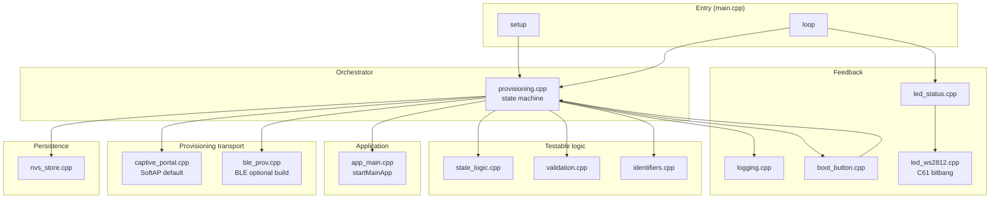
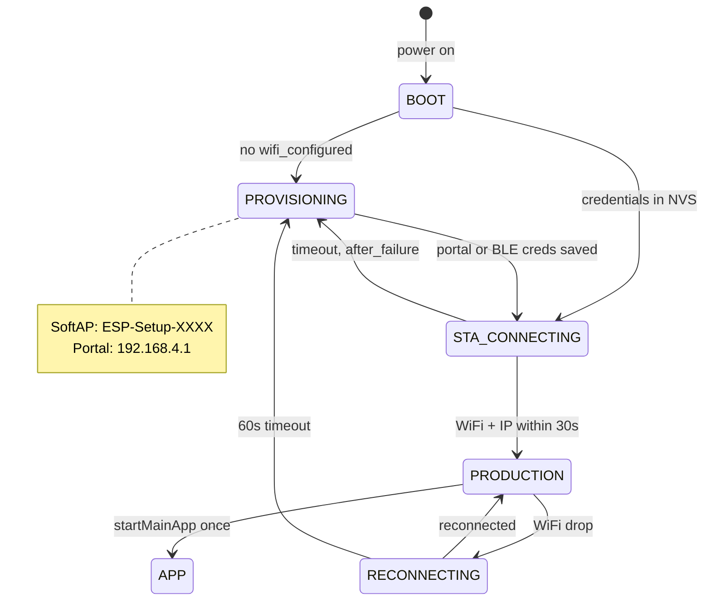
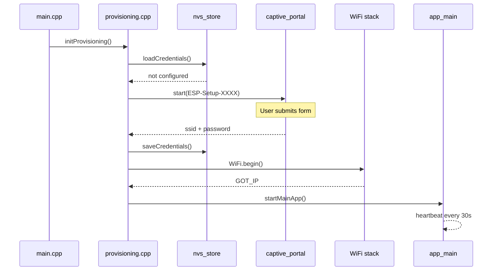
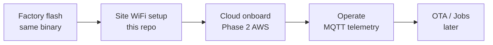

# ESP32-C61 WiFi Provisioning — Walkthrough

This walkthrough is for anyone who wants to **run**, **flash**, and **understand** the firmware — without building from source unless you are developing it.

| Audience | Start here |
|----------|------------|
| **Installer / demo** | [Flash from release](#flash-from-release-no-build) → [WiFi setup](#wifi-setup-installer) |
| **Developer / learner** | [Why C++](#why-c) → [Code tour](#code-architecture) → [IoT path](#what-you-need-for-iot) |

---

## What this project does

This firmware delivers **first-boot WiFi onboarding** — the baseline step almost every connected device needs before it can do anything on a network:

1. Device ships with **no site WiFi** configured.
2. On first boot it hosts a setup network (`ESP-Setup-XXXX`) and a **captive portal**.
3. You enter your **2.4 GHz** WiFi credentials in a browser.
4. Credentials are saved to **NVS flash** and survive reboots.
5. The device joins your network and hands off to **`startMainApp()`** (today a heartbeat; your product logic goes here).

Treat this repo as a **starting point**, not a one-off demo: the same provisioning flow, state machine, and NVS layout can carry into sensors, cloud backends, home automation, fleet dashboards, OTA updates, and other IoT use cases — you extend **`app_main.cpp`** after WiFi is up instead of rebuilding onboarding from scratch.

---

## Flash from release (no build)

Firmware is published automatically when a **version tag** is pushed (see [Releases](https://github.com/jajera/esp32-wifi-hotspot-demo/releases)).

### Prerequisites

| Item | Notes |
|------|--------|
| ESP32-C61-DevKitC-1 v2.0 | 8 MB flash typical |
| USB cable | **UART** Type-C port on the board |
| Linux/macOS | Windows: use WSL or install esptool manually |
| Python 3 | For `esptool` |
| Internet | To download the release binary once |

You do **not** need PlatformIO, Arduino IDE, or a git clone to flash.

### Flash (recommended)

Download the release binary and flash with `esptool`:

```bash
pip install esptool
curl -LO https://github.com/jajera/esp32-wifi-hotspot-demo/releases/download/v1.0.0-phase1/esp32-c61-softap.factory.bin
esptool.py --chip esp32c61 -p /dev/ttyUSB0 -b 460800 write_flash 0x0 esp32-c61-softap.factory.bin
```

Replace `v1.0.0-phase1` with the tag on the [Releases](https://github.com/jajera/esp32-wifi-hotspot-demo/releases) page and `/dev/ttyUSB0` with your serial port if needed.

### Optional: helper script

If you already have this repository (or only want the script), it downloads the same release artifact and verifies SHA256:

```bash
# from a clone — optional
./scripts/flash-softap.sh v1.0.0-phase1

# or fetch just the script (no full clone)
curl -fsSL -o flash-softap.sh \
  https://raw.githubusercontent.com/jajera/esp32-wifi-hotspot-demo/main/scripts/flash-softap.sh
chmod +x flash-softap.sh
./flash-softap.sh v1.0.0-phase1
```

Optional serial port:

```bash
./flash-softap.sh v1.0.0-phase1 /dev/ttyUSB0
```

### If flash fails

Hold **Boot**, press **Reset**, release **Boot** after upload starts.

### Serial monitor

```bash
pio device monitor -b 115200
# or: screen /dev/ttyUSB0 115200
```

Expect on first boot:

```text
[BOOT] FW=... chip=ESP32-C61 mac=... transport=softap wifi_configured=false
[SOFTAP] SSID=ESP-Setup-XXXX gateway=192.168.4.1
```

---

## WiFi setup (installer)

No laptop build tools required — only a phone or laptop with WiFi.

1. Power the board (USB).
2. On your phone/laptop, join Wi‑Fi **`ESP-Setup-XXXX`** (`XXXX` = last 2 bytes of MAC, e.g. `ECA4`).
3. Captive portal should open; if not, browse to **`http://192.168.4.1`**.
4. Enter your **2.4 GHz** network name and password → **Connect**.
5. Setup Wi‑Fi disappears; device joins your network.
6. **Confirm:** solid green LED (if working) or serial: `[WIFI] Connected IP=...` and `[APP] Heartbeat`.

**Reboot test:** unplug USB, plug back in — device should reconnect **without** showing `ESP-Setup-XXXX` again.

**Factory reset:** hold **Boot** 5 seconds → white flash → setup mode returns.

---

## Why C++

We use **C++ on Arduino (ESP32 core)** for this firmware. Here is why that is a reasonable choice for IoT edge devices.

| Reason | Explanation |
|--------|-------------|
| **Espressif ecosystem** | Official Arduino and ESP-IDF stacks, examples, and `WiFiProv` / `network_provisioning` are C/C++. |
| **Resource control** | You choose what runs on a 160 MHz MCU with limited RAM — no OS overhead of a full Linux image. |
| **Single binary** | One `.factory.bin` per transport profile; flash the same image on every unit; MAC-derived names at runtime. |
| **Deterministic loops** | `setup()` / `loop()` and a explicit state machine map cleanly to boot → provision → connect → app. |
| **Path to production** | Same code can move toward ESP-IDF, OTA, and AWS IoT Device SDK for Embedded C when Phase 2 lands. |

**Alternatives considered:**

| Option | Trade-off |
|--------|-----------|
| **MicroPython** | Faster to script; slower, larger, less common in factory flash flows. |
| **ESP-IDF (C) only** | Maximum control; steeper learning curve than Arduino wrappers. |
| **Rust** | Growing support; smaller example ecosystem for provisioning today. |

For a **repeatable WiFi onboarding milestone** that later connects to **AWS IoT**, C++ on Arduino is the pragmatic default: approachable, well documented, and close to what production ESP32 firmware often uses.

---

## Code architecture

### Entry point

Arduino firmware starts in **`src/main.cpp`**:

```cpp
void setup() {
    Serial.begin(SERIAL_BAUD);
    LedStatus::init();
    BootButton::init();
    NvsStore::init();
    logBootBanner(...);
    initProvisioning();   // state machine + transport
}

void loop() {
    loopProvisioning();   // WiFi, portal, timeouts, factory reset
    LedStatus::update(getCurrentState(), isProvisioningAfterFailure());
    delay(10);
}
```

`setup()` runs once at boot. `loop()` runs forever. Almost all behavior lives under **`initProvisioning()` / `loopProvisioning()`** in `provisioning.cpp`.

### High-level diagram



### Boot and runtime flow



### Call flow (first boot, SoftAP build)



---

## Source files (tour)

All firmware lives under **`src/`**.

| File | Role |
|------|------|
| **`main.cpp`** | Arduino entry: init serial, LED, button, NVS; call provisioning; update LED each loop. |
| **`config.h`** | Compile-time constants: timeouts, GPIO pins, PoP string, firmware version (from env in CI). |
| **`provisioning.h` / `provisioning.cpp`** | **Brain of the firmware.** State machine, WiFi events, starts/stops SoftAP or BLE, factory reset, calls `startMainApp()` once when connected. |
| **`provisioning_types.h`** | `DeviceState` and `Event` enums shared across modules. |
| **`state_logic.h` / `state_logic.cpp`** | Pure transition table + boot decision — host-testable without hardware. |
| **`nvs_store.h` / `nvs_store.cpp`** | Read/write WiFi credentials in flash (`wifi_ssid`, `wifi_password`, `wifi_configured`) via Arduino `Preferences`. |
| **`captive_portal.h` / `captive_portal.cpp`** | SoftAP + DNS hijack + HTTP form at `192.168.4.1`. **Default build only** (`#ifndef BLE_TRANSPORT`). |
| **`ble_prov.h` / `ble_prov.cpp`** | Espressif `WiFiProv` BLE path. **BLE build only** (`#ifdef BLE_TRANSPORT`). |
| **`validation.h` / `validation.cpp`** | Validates SSID/password lengths before writing NVS. |
| **`identifiers.h` / `identifiers.cpp`** | `ESP-Setup-XXXX` and `PROV_XXXX` from MAC address. |
| **`logging.h` / `logging.cpp`** | Structured serial logs (`[BOOT]`, `[STATE]`, `[WIFI]`, …). Never logs passwords. |
| **`led_status.h` / `led_status.cpp`** | Maps device state to RGB patterns (blue/yellow/green/red). |
| **`led_ws2812.h` / `led_ws2812.cpp`** | Bit-bang WS2812 driver for ESP32-C61 (no RMT on this chip). |
| **`boot_button.h` / `boot_button.cpp`** | Debounced Boot button; 5 s hold triggers factory reset. |
| **`app_main.h` / `app_main.cpp`** | **`startMainApp()`** — Phase 1 heartbeat; Phase 2 AWS code will plug in here only. |

### Build profiles

| PlatformIO env | Transport | When to use |
|----------------|-----------|-------------|
| `esp32-c61-softap` | Captive portal | Demo, workshops, no phone app |
| `esp32-c61-ble` | ESP BLE Prov app | Field install, consumer-style flow |

Same core modules; only `captive_portal` vs `ble_prov` differs at compile time.

### Tests (developers)

| Path | Purpose |
|------|---------|
| `test/test_core.cpp` | Host unit tests for validation, MAC names, state logic |
| `test/support/Arduino.h` | Minimal Arduino stub for native builds |
| `test/mocks/` | Headers for future HAL mocks |

Run: `pio test -e native`

---

## Programming concepts used

### 1. State machine

The device is always in one `DeviceState` (`PROVISIONING`, `STA_CONNECTING`, `PRODUCTION`, …). Events (credentials received, WiFi connected, timeout) trigger transitions. Keeping this in **`provisioning.cpp`** + testable **`state_logic.cpp`** avoids spaghetti `if` chains in `loop()`.

### 2. NVS as “saved settings”

WiFi credentials live in **non-volatile storage** (flash), not RAM. That is why unplugging USB does not wipe your WiFi — only factory reset or reflash clears it.

### 3. Compile-time transport selection

`#ifdef BLE_TRANSPORT` includes either captive portal or BLE, not both. One binary per profile; smaller flash and no runtime mode confusion.

### 4. Separation for Phase 2

**Rule:** WiFi onboarding modules do not know about AWS. **`app_main.cpp`** is the only application entry after WiFi is up. Phase 2 adds claim cert + `RegisterThing` inside `startMainApp()` without touching the portal.

---

## What you need for IoT

This repo is **Phase 1 only** (WiFi). A full IoT device lifecycle typically looks like:



| Stage | This project | Typical next step |
|-------|--------------|-----------------|
| **Flash firmware** | GitHub Release + `scripts/flash-softap.sh` | CI on every tag (automated) |
| **Network join** | Captive portal → NVS | Done in Phase 1 |
| **Cloud identity** | Not yet | AWS IoT fleet provisioning (claim cert → `RegisterThing`) |
| **Operate** | Heartbeat log only | MQTT topics, Device Shadow |
| **Update** | Not yet | OTA via HTTPS or AWS IoT Jobs |
| **Security** | Open setup AP (demo) | Setup AP password, NVS encryption, per-device PoP |

### Roles in production

| Role | Tools | Internet |
|------|-------|----------|
| **Factory / bench** | Flash script, esptool | Once (download binary) |
| **Installer** | Phone + browser | No (local setup AP) |
| **Cloud** | AWS IoT console / Terraform | Device needs WiFi + route to AWS |

### What “done” looks like for Phase 1

- [ ] Flashed from release (not local build)
- [ ] First boot → captive portal → connected
- [ ] Reboot → reconnects without portal
- [ ] Factory reset → portal again
- [ ] Serial shows `[APP] Heartbeat`

Then you are ready to design Phase 2 without changing WiFi NVS layout.

---

## Releases and tags (maintainers)

Publishing is **fully automated** — no manual upload.

1. Merge changes to `main`.
2. Create and push a tag:

```bash
git tag v1.0.0-phase1
git push origin v1.0.0-phase1
```

3. GitHub Actions workflow **`.github/workflows/release.yml`**:
   - Runs native tests
   - Builds `esp32-c61-softap` and `esp32-c61-ble`
   - Uploads `*.factory.bin`, `*.firmware.bin`, `SHA256SUMS`, `manifest.json` to **GitHub Releases**

CI on every push/PR: **`.github/workflows/ci.yml`** (tests + compile).

Firmware version string at runtime comes from the tag via `FIRMWARE_VERSION` environment variable in CI.

---

## Troubleshooting

| Symptom | Likely cause |
|---------|----------------|
| `ESP-Setup-XXXX` never appears | Flash failed or wrong chip; re-run flash script |
| Portal does not open | Join setup Wi‑Fi manually; go to `192.168.4.1` |
| Stuck after wrong password | Wait 30s; portal returns (red LED if LED works) |
| `wifi_configured=false` after success | NVS write failed; check serial for `[CREDS]` errors |
| RMT errors on old builds | Upgrade to release with C61 bitbang LED driver |

---

## Further reading

- Requirements / design / tasks: `.kiro/specs/esp32-wifi-provisioning/`
- Repo README: [README.md](../README.md)
- Espressif ESP32-C61 DevKitC: [documentation](https://docs.espressif.com/projects/esp-dev-kits/en/latest/esp32c61/esp32-c61-devkitc-1/index.html)
